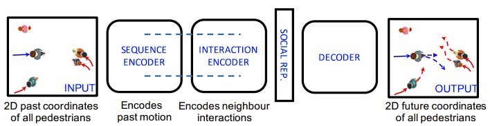
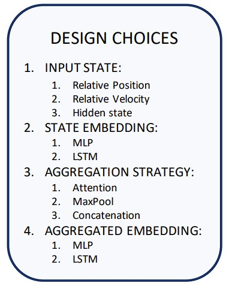

# Report 3

Social-LSTM Overview          |  Interaction Encoder (Non-grid-based)
:-------------------------:|:-------------------------:
|  

1. The state of each pedestrian at each time-step is represented using their velocity and is embedded using a single layer MLP to get the state embedding.

2. The interaction module takes as input information the relative velocity of nearest neighbours and outputs an interaction vector that represents the social interactions between them
(Non-grid-based methods have a additional LSTM/MLP as their State Embedding, Grid-base-methods only have a LSTM/MLP on the aggregated State).

3. The interaction vector is concatenated with the velocity embedding **(1.)** and provided as input to the time-sequence encoder, which is an LSTM that encodes the past motion of pedestrians. The output of this is the Social Representation.

4. The decoder LSTM then predicts future trajectory.

Conclusion:
 - The encoder of each pedestrian takes the the velocity of its own complete past trajectory and the relative velocity of the nearest neighbours into account to create a social representation.

## "Hard-Coding" the understanding of physics
-----------------------------------------------
- As explained above, parts of this have already been done by only training and evaluating with velocity and manually calculating position afterwards.
- Acceleration could be added to the social representation to provide more input that does need to be implictly learned by the encoder and decoder?
- Only use acceleration as the input to some or all of the modules?

## Next Steps:
-----------------------------------
1. Design the more structured network and figure out how to integrate it into Trajnet++