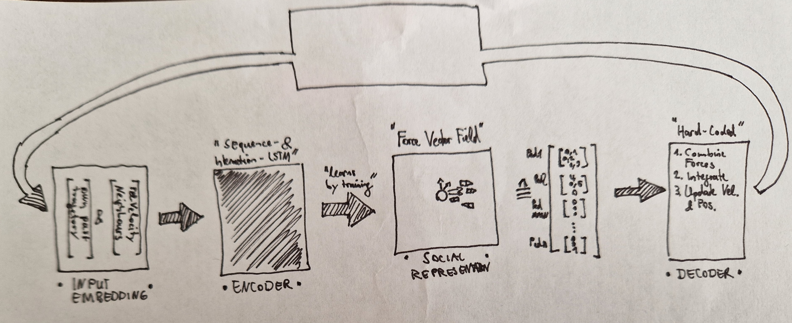

# Report 5

## Force Vector Field - Social Representation
-----------------------------------------------
(MAIN = Main Pedestrian/Vehicles, OTHER = One of the other Pedestrians/Vehicles)
- Designed by hand
- Shall be learned by the Encoder-LSTM
- ### **Design V0.1A:**
    - Each Output = Force to MAIN by OTHER
    - if #Outputs > #Pedestrians/#Vehicles 0 => all Outputs above = 0
    - **Flaws:**
        - if all forces are only combined at the end, the loss and training wont be able to "tell" the Encoder-LSTM anything about the purpose of the seperate forces in the multiple outputs => LSTM could already combine all forces into one output => Will not be able to learn this Social Representation
    - **Ideas:**
        - Let the outputs be only the direction of the forces
        - Manually add magnitude depending on for example distance
        - Might "show" Encoder-LSTM the difference between the seperate outputs
- ### **Design V0.1B:**
    - Start with a vector field that follows the road and direction of MAIN (or for now maybe just the initial direction of MAIN)
    - Each output = manipulation in the Vector Field by OTHER
    - #Outputs = "Resolution" of Vector Field
    - Each Output is one point in this resolution that can be manipulated
-------------------------------------
---------------------------------------
## Currently working on:
- Changing Linear Layer of Encoder to fit the output shape

## Next Steps:
- Depending on which design, hard-code the decoder to interpret the output of the encoder as a force field
